# menu-creator
Restaurant menu creator using MERN stack.

Visit https://mern-menu-creator.web.app/ to create an account and use the app.

Users can sign up for an account and create menus that they would like to create, and add items accordingly. Users can also view other user's menus as well.

Login
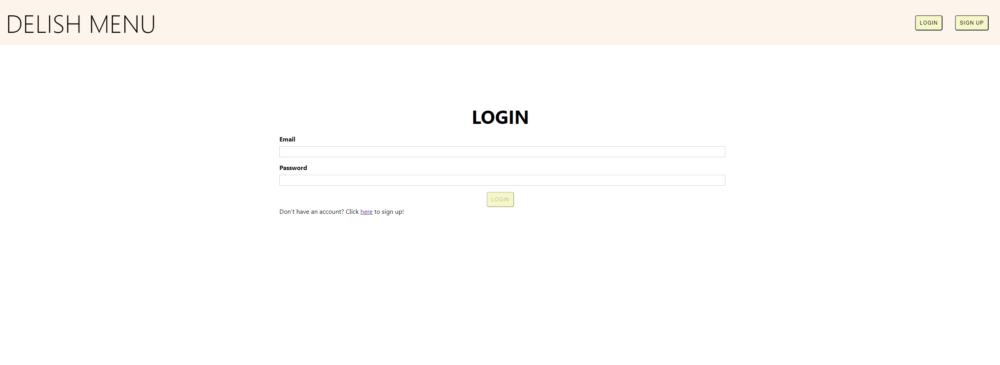

Sign up
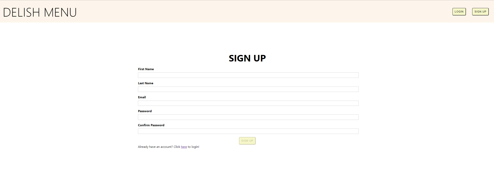

Home
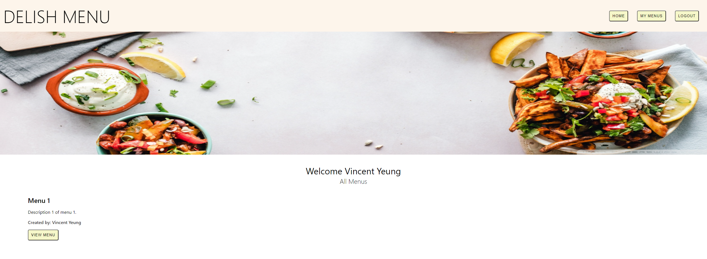

Your menus
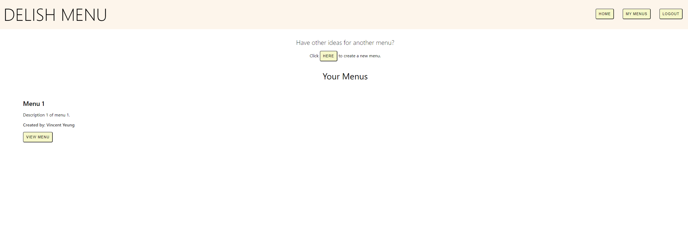

View menu
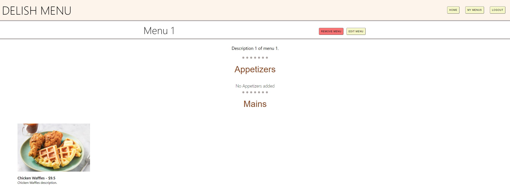

Create Menu
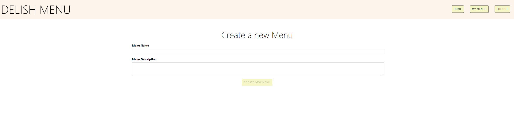

Edit menu
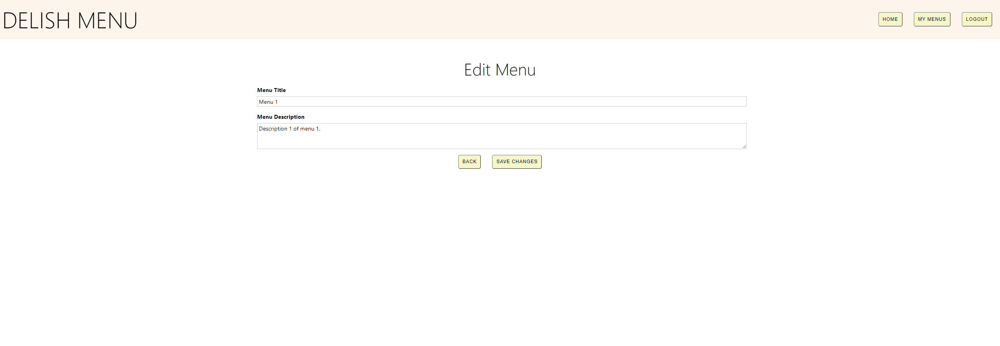

Remove menu
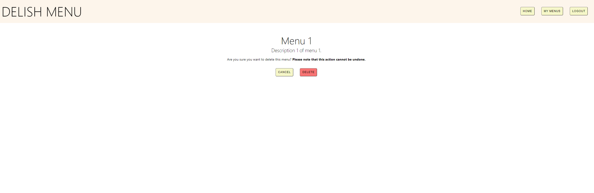

Create item
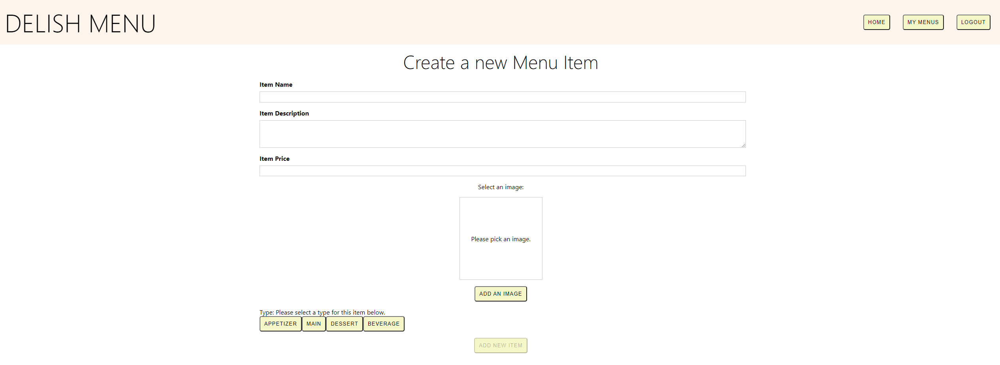

Update item
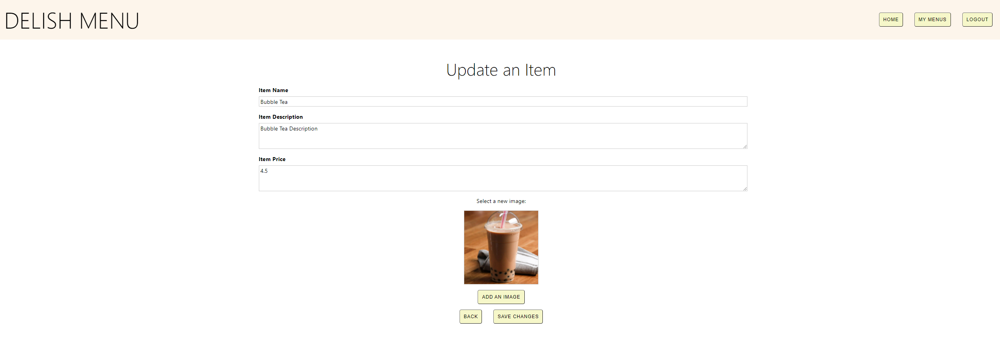

Remove item
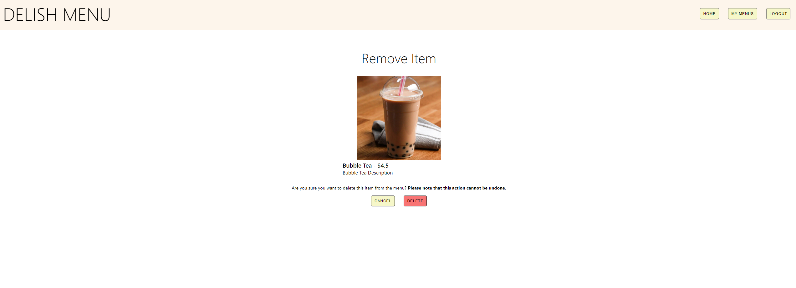

API's are hosted on https://mern-menu-creator.herokuapp.com/api.

| API routes | Type | actions |
| --- | --- | --- |
| /users | 'GET' | Retrieve all users and returns as a 'users' object. |
| /users/login | 'POST' | Accepts 'email' and 'password' fields and returns a 'user' object with 'userId', 'email', 'token'. |
| /users/signup | 'POST' | Accepts 'firstname', 'lastname', 'email', 'password' fields and returns a 'user' object with 'userId', 'email', 'token'. |
| /menus | 'GET' | Retrieve all menus and returns a 'menus' object. |
| /menus/user/:userId | 'GET' | Retrieves menus of a user with userId. Returns a 'menus' object. |
| /menus/:menuId | 'GET' | Retrieves a menu with a given menuId. Returns a 'menu' object. |
| /menus | 'POST' | Creates a new menu and accepts 'title', 'description', 'creator' fields. Returns a 'menu' object. |
| /menus/:menuId | 'PATCH' | Updates a menu with the specified menuId. Accepts 'title' and 'description' fields. Returns a 'menu' object. |
| /menus/:menuId | 'DELETE' | Removes a menu with the specified menuId from the database. |
| /menuItems | 'GET' | Retrieve all menu items and returns a 'menuItems' object. |
| /menuItems/menu/:menuId | 'GET' | Retrieves menu items given a specific menuId. Returns a 'menuItems' object. |
| /menuItems/:itemId | 'GET' | Retrieves a menu item given a specific itemId. Returns a 'menuItem' object. |
| /menuItems/:menuId | 'POST' | Creates a new item for a given menuId. Accepts 'title', 'description', 'price', 'type', 'image' fields. Returns a 'menuItem' object. |
| /menuItems/:menuItemId | 'PATCH' | Updates a menu item with a speficied menuItemId. Accepts 'title', 'description', 'price' fields. Returns a 'menuItem' object. |
| /menuItems/:menuItemId | 'DELETE' | Removes a menu item with the specified menuItemId. |
